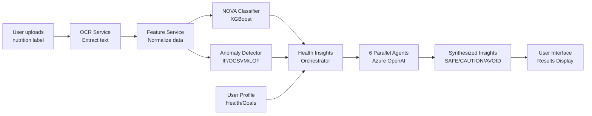

# NutriVision AI

## Context Aware Nutritional Assessment
### Predicting Food Processing Tiers through Machine Learning

An end-to-end machine learning system for predicting food processing tiers (NOVA classification) with anomaly detection, multi-agent health insights, and personalized nutritional guidance using Open Food Facts data.

## Team and Academic Details

- **Team members:**
  - Jamshed Nabizada
  - Swapnil Patil
- **Professor:** Anna Marbut
- **Course:** AAI-590 Capstone Project
- **Program:** Master of Science in Applied Artificial Intelligence
- **University:** University of San Diego
- **School:** Shiley Marcos School of Engineering

## Table of Contents

- [UI Demo](#ui-demo)
- [Key Features](#key-features)
- [Quick Start](#quick-start)
- [Project Brief](#project-brief)
- [Team and Academic Details](#team-and-academic-details)
- [Technology Stack](#technology-stack)
- [Notebook Pipeline](#notebook-pipeline)
- [Multi-Agent Architecture](#multi-agent-architecture)
- [Key Results](#key-results)
- [Repository Structure](#repository-structure)
- [Prerequisites](#prerequisites)
- [Dataset Setup](#dataset-setup)
- [Using the Notebooks](#using-the-notebooks)
- [Running the Frontend](#running-the-frontend)
- [Running the Backend API](#running-the-backend-api)
- [Deployment](#deployment)
- [Complete System Workflow](#complete-system-workflow)
- [Dataset Information](#dataset-information-and-data-dictionary)
- [Future Enhancements](#future-enhancements)
- [Contributing](#contributing)
- [License](#license)
- [Acknowledgments](#acknowledgments)
- [AI Use Disclosure](#ai-use-disclosure)
- [Contact](#contact)

## UI Demo

- Live demo: https://swapnilprakashpatil.github.io/aai590_5_capstone_project/

## View Notebooks Online

Explore the complete machine learning pipeline through our interactive notebooks hosted on GitHub Pages:

1. **Exploratory Data Analysis**: https://swapnilprakashpatil.github.io/aai590_5_capstone_project/01_Exploratory_Data_Analysis.html
2. **Feature Engineering and Model Preparation**: https://swapnilprakashpatil.github.io/aai590_5_capstone_project/02_Feature_Engineering_and_Model_Preperation.html
3. **Model Training and Evaluation**: https://swapnilprakashpatil.github.io/aai590_5_capstone_project/03_Model_Training_and_Evaluation.html
4. **Hyperparameter Tuning and Final Evaluation**: https://swapnilprakashpatil.github.io/aai590_5_capstone_project/04_Hyperparameter_Tuning_and_Final_Evaluation.html
5. **Anomaly Detection**: https://swapnilprakashpatil.github.io/aai590_5_capstone_project/05_Anomaly_Detection.html

## Key Features

### 🎯 NOVA Classification

- **4-tier processing level prediction** (Unprocessed → Ultra-processed)
- **XGBoost classifier** with 85.7% macro F1 score
- **SHAP explainability** showing feature importance
- **Confidence scores** for model predictions

### 🔍 Anomaly Detection

- **Three complementary models** (Isolation Forest, One-Class SVM, LOF)
- **Whole-food baseline** trained exclusively on NOVA 1 products
- **Nutritional outlier identification** across all processing tiers
- **Real-time anomaly flagging** with severity scores

### 🤖 Multi-Agent Health Insights

- **6 specialized AI agents** running in parallel via Azure OpenAI
- **Personalized recommendations** based on health profile
- **Evidence-based rationale** with citations
- **SAFE/CAUTION/AVOID** decision framework
- **Product alternatives** with specific suggestions

### 📸 OCR & Image Processing

- **Nutrition label text extraction** from photos
- **Smart field mapping** to nutritional attributes
- **Unit normalization** for consistent analysis
- **Batch processing** support

### 🎨 Interactive Web Interface

- **Sample product gallery** with 12+ pre-loaded items
- **3-step demo workflow** (Profile → Product → Insights)
- **Real-time processing** with progress indicators
- **Responsive design** optimized for mobile and desktop
- **Profile persistence** via localStorage

## Quick Start

### Try the Live Demo (No Installation)

Visit https://swapnilprakashpatil.github.io/aai590_5_capstone_project/ to:

- Upload nutrition labels for instant NOVA classification
- Explore sample products with pre-loaded labels
- See anomaly detection in action

### Run Locally (Full System)

**1. Clone the Repository**

```powershell
git clone https://github.com/SwapnilPrakashPatil/aai590_5_capstone_project.git
cd aai590_5_capstone_project
```

**2. Set Up Python Environment**

```powershell
python -m venv .venv
.\.venv\Scripts\Activate.ps1
pip install -r requirements.txt
```

**3. Download Dataset** (Optional - only for notebooks)

```powershell
Invoke-WebRequest -Uri "https://world.openfoodfacts.org/data/en.openfoodfacts.org.products.csv.gz" -OutFile "dataset/en.openfoodfacts.org.products.csv.gz"
# Extract to dataset/ folder
```

**4. Run Backend API**

```powershell
cd backend
# Optional: Configure .env for multi-agent insights
python main.py
# API available at http://localhost:8000
```

**5. Run Frontend**

```powershell
cd frontend
npm install
npm run dev
# App available at http://localhost:5173
```

**6. Explore Notebooks** (Optional)

```powershell
jupyter notebook
# Open 01_Exploratory_Data_Analysis.ipynb and run sequentially
```

## Project Brief

This capstone project focuses on identifying the industrial processing level of food products from nutritional and ingredient-related features, detecting nutritional anomalies, and providing personalized health insights through an AI-powered multi-agent system.

**Core Components:**

1. **NOVA Classification Pipeline** - Predict food processing tiers (NOVA groups 1-4) using XGBoost with SHAP explainability
2. **Anomaly Detection System** - Identify nutritionally unusual products by measuring deviation from whole-food baselines
3. **Multi-Agent Health Insights** - Six specialized AI agents powered by Azure OpenAI providing personalized nutrition guidance
4. **Interactive Web Platform** - React + Vite frontend with OCR-based label scanning and real-time health assessment

**Key Innovation:**

Moving beyond traditional calorie/macro tracking to provide quality signals through processing tier prediction, anomaly flagging, and context-aware health recommendations personalized to individual health profiles, dietary restrictions, and wellness goals.

## Technology Stack

### Machine Learning & Data Science

- **ML Framework:** XGBoost, scikit-learn, LightGBM
- **Anomaly Detection:** Isolation Forest, One-Class SVM, Local Outlier Factor
- **Explainability:** SHAP (SHapley Additive exPlanations)
- **Hyperparameter Tuning:** Optuna (Bayesian optimization)
- **Data Processing:** pandas, NumPy
- **Visualization:** Matplotlib, Plotly, Seaborn

### Backend

- **API Framework:** FastAPI with async support
- **AI Orchestration:** Multi-agent system with parallel execution
- **LLM Integration:** Azure OpenAI (GPT-4)
- **OCR:** Pillow for image processing
- **Server:** Uvicorn (ASGI) / Gunicorn (production)

### Frontend

- **Framework:** React 18 with Vite
- **Styling:** Tailwind CSS
- **HTTP Client:** Axios
- **Markdown Rendering:** react-markdown
- **Build Tool:** Vite

### Development & Deployment

- **Notebooks:** Jupyter Lab
- **Version Control:** Git
- **Cloud Platform:** Azure (App Service, OpenAI)
- **Static Hosting:** GitHub Pages
- **Package Management:** pip, npm

## Notebook Pipeline

The project follows a five-notebook pipeline, each building on artifacts from the previous step:

| #   | Notebook                                              | Purpose                                                                                                                                                                                                |
| --- | ----------------------------------------------------- | ------------------------------------------------------------------------------------------------------------------------------------------------------------------------------------------------------ |
| 1   | `01_Exploratory_Data_Analysis.ipynb`                  | Data quality assessment, target/feature distributions, correlation analysis, outlier detection, missing-data imputation, and cleaned parquet export.                                                   |
| 2   | `02_Feature_Engineering_and_Model_Preperation.ipynb`  | Feature selection, engineered ratio features (e.g. sugar/fiber, fat/protein, additives/energy), train/val/test split, scaling, and XGBoost baseline.                                                   |
| 3   | `03_Model_Training_and_Evaluation.ipynb`              | Comparative evaluation of Random Forest, XGBoost, MLP, and LightGBM under consistent metrics; XGBoost selected as best candidate (Macro F1 = 0.856).                                                   |
| 4   | `04_Hyperparameter_Tuning_and_Final_Evaluation.ipynb` | Bayesian hyperparameter tuning with Optuna, held-out test evaluation, and SHAP explainability analysis.                                                                                                |
| 5   | `05_Anomaly_Detection.ipynb`                          | Train three anomaly detection models (Isolation Forest, One-Class SVM, Local Outlier Factor) exclusively on NOVA 1 whole foods to identify nutritionally unusual products across all processing tiers. |

Run notebooks in order — each one saves artifacts consumed by the next.

## Multi-Agent Architecture

The backend implements a sophisticated multi-agent system that transforms model predictions into actionable personalized health insights.

### Health Insights Orchestrator

The `HealthInsightsOrchestrator` coordinates six specialized AI agents running in parallel via Azure OpenAI:

| Agent                                  | Purpose                                                                         |
| -------------------------------------- | ------------------------------------------------------------------------------- |
| **Nutritional Analysis Expert**        | Detailed breakdown of macronutrients, micronutrients, and nutritional adequacy  |
| **Health Risk Assessment Expert**      | Identifies potential health risks based on product composition and user profile |
| **Dietary Recommendations Specialist** | Personalized nutrition guidance aligned with health conditions and goals        |
| **Product Alternatives Advisor**       | Suggests healthier alternatives with specific product recommendations           |
| **Long-Term Health Impact Analyst**    | Projects long-term health outcomes of regular consumption                       |
| **Technical Analysis Agent**           | Explains AI reasoning, model confidence, and agent orchestration process        |

### Architecture Flow

```
User Profile + Product Data
         ↓
    OCR Service → Feature Extraction
         ↓
  NOVA Classification (XGBoost)
         ↓
  Anomaly Detection (IF/OCSVM/LOF)
         ↓
  Orchestrator → 6 Parallel Agents
         ↓
  Synthesized Health Insights
```

### Decision Logic

**Safety Assessment:**

- Hard constraints (allergens, medical contraindications)
- Soft scoring (nutritional goals, preferences)
- Processing tier penalty (NOVA 4 products flagged)
- Anomaly flags (nutritional outliers highlighted)

**Final Output:** SAFE / CAUTION / AVOID with evidence-based rationale, citations, and alternatives.

## Key Results

### NOVA Classification Performance

| Metric            | Baseline (Validation) | Tuned (Test) |
| ----------------- | --------------------- | ------------ |
| Macro F1          | 0.856                 | 0.857        |
| Balanced Accuracy | 0.882                 | 0.882        |
| Weighted F1       | 0.875                 | 0.878        |
| ROC-AUC (OVR)     | 0.974                 | 0.974        |

**Top SHAP features (overall):** added_sugars_100g, additives_n, additives_per_energy, salt_100g, proteins_100g.

NOVA 3 (processed foods) remains the most challenging class across all models, primarily confused with NOVA 4.

### Anomaly Detection Performance

Three models trained exclusively on NOVA 1 (whole foods) to detect nutritional outliers:

| Model                | Training Duration | Anomalies Detected (NOVA 4) |
| -------------------- | ----------------- | --------------------------- |
| Isolation Forest     | 0.22s             | 2,485 (24.8%)               |
| One-Class SVM        | 169.34s           | 1,847 (18.4%)               |
| Local Outlier Factor | 4.65s             | 2,614 (26.1%)               |

**Key Insight:** Ultra-processed products (NOVA 4) show significantly higher anomaly rates compared to whole foods, validating the nutritional deviation hypothesis.

## Repository Structure

```
├── 01_Exploratory_Data_Analysis.ipynb
├── 02_Feature_Engineering_and_Model_Preperation.ipynb
├── 03_Model_Training_and_Evaluation.ipynb
├── 04_Hyperparameter_Tuning_and_Final_Evaluation.ipynb
├── 05_Anomaly_Detection.ipynb
├── Readme.md
├── requirements.txt
├── start.ps1
│
├── backend/
│   ├── main.py                          # FastAPI server with OCR and prediction endpoints
│   ├── agents/
│   │   ├── orchestrator_agent.py        # Multi-agent coordinator
│   │   ├── nutritional_analysis_agent.py
│   │   ├── health_risks_agent.py
│   │   ├── dietary_recommendations_agent.py
│   │   ├── alternative_products_agent.py
│   │   ├── long_term_health_agent.py
│   │   ├── technical_analysis_agent.py
│   │   ├── base_agent.py                # Base agent class
│   │   └── models.py                    # Pydantic models
│   └── models/                          # Saved model artifacts
│       ├── xgb_tuned.json
│       ├── final_scaler.joblib
│       ├── anomaly_models.joblib
│       └── feature_names.json
│
├── frontend/
│   ├── src/
│   │   ├── App.jsx
│   │   ├── api.js
│   │   └── components/
│   │       ├── SampleProductGallery.jsx    # Product selection UI
│   │       ├── HealthInsightsPanel.jsx     # Multi-agent results display
│   │       ├── DemoPage.jsx                # Complete workflow demo
│   │       └── Navbar.jsx
│   ├── public/
│   │   └── labels/                      # Sample nutrition label images
│   └── index.html
│
├── dataset/
│   ├── en.openfoodfacts.org.products.csv
│   ├── light.csv
│   └── processed/                       # Cleaned and processed data
│
├── results/
│   ├── features/                        # Feature engineering artifacts
│   ├── training/                        # Model comparison results
│   ├── tuning/                          # Hyperparameter tuning outputs
│   └── anomaly_detection/               # Anomaly model results
│
├── src/
│   ├── eda/                            # Reusable EDA modules
│   ├── modeling/                       # Reusable modeling modules
│   └── anomaly/                        # Anomaly detection modules
│       ├── models.py
│       ├── inference.py
│       ├── evaluation.py
│       └── plots.py
│
├── docs/                               # Project documentation
│   └── _build/
│       ├── Personalized_Nutrition_Orchestration_Architecture.md
│       ├── IMPLEMENTATION_SUMMARY.md
│       └── AGENTS_DOCUMENTATION.md
│
├── deploy/                             # Deployment configuration
│   ├── startup.sh
│   ├── gunicorn.conf.py
│   └── requirements.txt
│
└── scripts/                            # Utility scripts
    ├── create_light_dataset.py
    ├── deploy-azure.ps1
    └── import_to_github_project.py
```

## Prerequisites

- Python 3.10+ (recommended)
- Node.js 18+ and npm
- Jupyter Notebook or JupyterLab

## Dataset Setup

Source dataset:

- Open Food Facts official export: https://world.openfoodfacts.org/data/en.openfoodfacts.org.products.csv.gz

1. Download the dataset:

```powershell
Invoke-WebRequest -Uri "https://world.openfoodfacts.org/data/en.openfoodfacts.org.products.csv.gz" -OutFile "dataset/en.openfoodfacts.org.products.csv.gz"
```

2. Decompress and place the extracted file in `dataset/`.
3. Confirm the primary file path exists before running notebooks:

```text
dataset/en.openfoodfacts.org.products.tsv
```

## Using the Notebooks

1. Create and activate a Python virtual environment (optional but recommended):

```powershell
python -m venv .venv
.\.venv\Scripts\Activate.ps1
```

2. Install Python dependencies:

```powershell
pip install -r requirements.txt
```

3. Start Jupyter:

```powershell
jupyter notebook
```

4. Open notebooks in order, starting with `01_Exploratory_Data_Analysis.ipynb`, and run cells sequentially. Each notebook saves artifacts (cleaned data, splits, models, metrics) consumed by the next.

Notes:

- Keep data files in `dataset/` so notebook paths remain valid.
- If kernel/package issues occur, confirm the notebook is using the same `.venv` environment where dependencies were installed.

## Running the Frontend

The frontend provides an interactive web interface for product analysis and personalized health insights.

### Hosted Demo

- **Live Application:** https://swapnilprakashpatil.github.io/aai590_5_capstone_project/
- **Features:**
  - Product label upload and OCR
  - NOVA classification visualization
  - Anomaly detection results
  - Multi-agent health insights (requires backend API)
  - Sample product gallery with 12+ pre-loaded items
  - Interactive 3-step demo workflow

### Local Development

From the `frontend/` folder:

1. Install dependencies:

```powershell
npm install
```

2. Configure backend API endpoint:

Update `frontend/src/api.js` to point to your backend:

```javascript
const API_BASE_URL = "http://localhost:8000";
```

3. Start the development server:

```powershell
npm run dev
```

4. Open `http://localhost:5173` in your browser.

### Alternative Launch Scripts

- **Windows PowerShell:** `./start.ps1`
- **macOS/Linux:** `bash start.sh`

### Frontend Features

**Main Analysis Page:**

- Drag-and-drop or click to upload nutrition labels
- Real-time OCR processing
- NOVA classification with confidence scores
- Anomaly detection flags
- Processing tier explanation

**Demo Page (`/demo`):**

- **Step 1:** User Profile Configuration
  - Pre-populated with realistic defaults
  - Editable health conditions, goals, dietary restrictions, allergies
  - Profile persistence via localStorage
- **Step 2:** Product Selection
  - Interactive gallery with 12 sample products
  - Hover to view nutrition labels
  - Search and category filtering
  - NOVA classification badges
- **Step 3:** Multi-Agent Health Insights
  - Tabbed interface for 6 insight categories
  - Real-time loading indicators
  - Markdown-formatted results
  - Agent execution metadata
  - Error handling with retry logic

**Additional Commands:**

```powershell
npm run build    # Production build
npm run preview  # Preview production build
```

## Running the Backend API

The backend provides RESTful API endpoints for NOVA classification, anomaly detection, and multi-agent health insights.

### Prerequisites

1. Install backend dependencies:

```powershell
pip install fastapi uvicorn xgboost pandas scikit-learn joblib pillow python-multipart openai python-dotenv
```

2. Configure Azure OpenAI (for multi-agent insights):

Create a `.env` file in the `backend/` directory:

```env
AZURE_OPENAI_ENDPOINT=https://your-endpoint.openai.azure.com/v1
AZURE_OPENAI_ROUTER_API_KEY=your-api-key
AZURE_OPENAI_ROUTER_DEPLOYMENT_NAME=your-deployment-name
```

### Launch API Server

From the project root:

```powershell
cd backend
python main.py
```

The server will start at `http://localhost:8000`

### API Endpoints

| Endpoint                 | Method | Purpose                                                   |
| ------------------------ | ------ | --------------------------------------------------------- |
| `/analyze`               | POST   | OCR + NOVA classification + anomaly detection             |
| `/health-insights`       | POST   | Generate multi-agent health insights from product data    |
| `/analyze-with-insights` | POST   | Complete pipeline: OCR → Classification → Health Insights |
| `/test/mock-insights`    | POST   | Test multi-agent system with mock data                    |
| `/health`                | GET    | Health check endpoint                                     |

### Example Usage

**Test with product image:**

```bash
curl -X POST "http://localhost:8000/analyze" \
  -F "file=@path/to/nutrition_label.jpg"
```

**Get health insights:**

```bash
curl -X POST "http://localhost:8000/health-insights" \
  -H "Content-Type: application/json" \
  -d '{
    "product_data": {...},
    "user_profile": {
      "age": 35,
      "health_conditions": ["high blood pressure"],
      "goals": ["weight loss", "heart health"]
    }
  }'
```

## Deployment

The project includes deployment configurations for cloud hosting.

### Azure Deployment

Deployment script and configuration files are provided in the `deploy/` folder:

- **`deploy-azure.ps1`** - PowerShell deployment script for Azure App Service
- **`startup.sh`** - Azure App Service startup script
- **`gunicorn.conf.py`** - Production WSGI server configuration
- **`requirements.txt`** - Production Python dependencies

### Static Frontend Deployment

The frontend can be deployed to GitHub Pages, Netlify, Vercel, or any static hosting service:

```powershell
cd frontend
npm run build
# Deploy the dist/ folder to your hosting service
```

**Current live deployment:** https://swapnilprakashpatil.github.io/aai590_5_capstone_project/

## Complete System Workflow

### End-to-End Process



### Step-by-Step Flow

1. **Image Upload** - User provides nutrition label photo or selects from gallery
2. **OCR Processing** - Extract text and map to nutritional fields
3. **Feature Engineering** - Apply same transformations used in training (ratios, scaling)
4. **NOVA Classification** - XGBoost predicts processing tier with confidence
5. **Anomaly Detection** - Three models flag nutritional outliers
6. **Profile Matching** - Load user's health conditions, goals, restrictions
7. **Parallel Agent Execution** - 6 specialized agents generate insights simultaneously
8. **Result Synthesis** - Combine predictions, flags, and insights into unified assessment
9. **Decision Rendering** - Display SAFE/CAUTION/AVOID with evidence and alternatives

### Data Flow

```
Raw Image → OCR → Features → Models → Predictions → Agents → Insights → User
                     ↓                      ↑
                  Scaler              User Profile
                     ↓                      ↑
               Feature Names          Health Context
```

## Dataset Information and Data Dictionary

### Dataset Information

- **Name:** Open Food Facts - World Food Facts
- **Source:** https://world.openfoodfacts.org/data/en.openfoodfacts.org.products.csv.gz
- **Primary file used in this project:** `dataset/en.openfoodfacts.org.products.tsv`
- **Format:** Tab-separated values (TSV)
- **Granularity:** One row per product
- **Primary objective in this project:** Predict food processing tiers (NOVA classes) from nutrition and ingredient-related signals

### Data Dictionary (Key Fields)

The full dataset contains many columns; this project primarily uses the fields below.

| Field                | Type          | Description                                                             |
| -------------------- | ------------- | ----------------------------------------------------------------------- |
| `code`               | string        | Product barcode/identifier.                                             |
| `product_name`       | string        | Human-readable product name.                                            |
| `brands`             | string        | Brand name(s) associated with the product.                              |
| `categories`         | string        | Product category labels (often comma-separated).                        |
| `ingredients_text`   | string        | Raw ingredient list text from package labeling.                         |
| `additives_n`        | numeric       | Count of detected additives in the product.                             |
| `nova_group`         | numeric (1-4) | NOVA processing class label used as the target variable when available. |
| `energy_100g`        | numeric       | Energy per 100g (typically kJ in Open Food Facts exports).              |
| `fat_100g`           | numeric       | Total fat per 100g.                                                     |
| `saturated-fat_100g` | numeric       | Saturated fat per 100g.                                                 |
| `carbohydrates_100g` | numeric       | Total carbohydrates per 100g.                                           |
| `sugars_100g`        | numeric       | Sugars per 100g.                                                        |
| `fiber_100g`         | numeric       | Dietary fiber per 100g.                                                 |
| `proteins_100g`      | numeric       | Protein per 100g.                                                       |
| `salt_100g`          | numeric       | Salt per 100g.                                                          |
| `sodium_100g`        | numeric       | Sodium per 100g (sometimes derived from salt).                          |

Notes:

- Column availability and completeness can vary by product and country.
- Missing values are expected and should be handled during preprocessing.
- Some fields may appear with minor naming variations depending on dataset version.
- `nova_group` availability depends on the dataset version/source. If missing in older snapshots, use the latest official Open Food Facts export.

## Future Enhancements

### Planned Features

- **Mobile App** - Native iOS/Android applications with camera integration
- **Real-time Barcode Scanning** - Direct product lookup via barcode API
- **Meal Planning** - Daily/weekly meal recommendations based on health goals
- **Progress Tracking** - Historical analysis of food choices and health metrics
- **Social Features** - Share recipes and product reviews with community
- **Expanded Language Support** - Multi-language OCR and insights
- **Offline Mode** - Local model inference without internet connection

### Model Improvements

- **Ensemble Methods** - Combine multiple classifiers for improved accuracy
- **Deep Learning** - CNN-based direct label image classification
- **Transfer Learning** - Fine-tune vision transformers for nutrition label understanding
- **Active Learning** - Incorporate user feedback to improve predictions
- **Multi-Task Learning** - Joint prediction of NOVA class, allergens, and nutrition quality

### Agent Enhancements

- **Memory System** - Track user preferences and past recommendations
- **Voice Interface** - Natural language queries via speech recognition
- **Real-time Updates** - Stream agent insights as they're generated
- **Custom Agents** - User-configurable agents for specific health conditions
- **Integration with Wearables** - Sync with fitness trackers and health apps

## Contributing

This is an academic capstone project completed for AAI-590 at the University of San Diego. While the project is not actively accepting external contributions, you may:

- Fork the repository for educational purposes
- Report issues or suggest improvements via GitHub Issues
- Cite this work in academic or non-commercial projects

## License

This project is developed for academic purposes as part of the Master of Science in Applied Artificial Intelligence program at the University of San Diego.

**Dataset License:** Open Food Facts data is available under the Open Database License (ODbL).

## Acknowledgments

- **Open Food Facts** - For providing the comprehensive open-source food products database
- **University of San Diego** - Shiley Marcos School of Engineering
- **Professor Anna Marbut** - Course instructor and advisor
- **Azure OpenAI** - For powering the multi-agent insights system
- **Open-source Community** - For the excellent ML and web development tools

## AI Use Disclosure

AI assistance tools were used in the following capacities during the development of this project:

- **Research and Planning:** AI tools were used to search for code snippets, explore modeling approaches, and identify applicable machine learning techniques (e.g., NOVA classification strategies, anomaly detection methods, SHAP explainability patterns). These suggestions were reviewed, adapted, and validated by the team before implementation.

- **Copy Editing and Report Refinement:** An AI assistant was used to copy edit written documentation and the final report draft, check for redundancy, and provide feedback on areas that could be tightened up or that required additional clarification. The prompt provided to the tool included context about the project purpose, target audience (academic evaluators for the AAI-590 Capstone), and formatting guidelines.

All AI-generated suggestions were critically reviewed by the team. Final decisions regarding methodology, implementation, and written content remain the work of the authors.

## Contact

**Team Members:**

- Jamshed Nabizada
- Swapnil Patil

**Institution:** University of San Diego  
**Program:** Master of Science in Applied Artificial Intelligence  
**Course:** AAI-590 Capstone Project

---

**Built with ❤️ for better nutrition awareness and healthier food choices**
