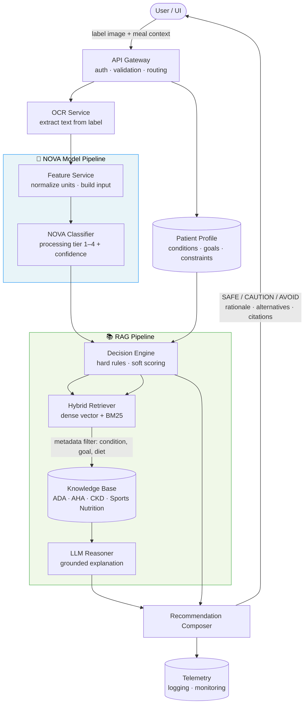

# Personalized Nutrition Orchestration Architecture

## Overview

This system extends NOVA food processing predictions into personalized nutrition guidance. For each scanned food item it answers:

1. Is this food safe for this user's health profile?
2. Does it align with their goals?
3. What are better alternatives?

---

## Architecture Diagram



---

## Core Components

| Component                   | Responsibility                                                         |
| --------------------------- | ---------------------------------------------------------------------- |
| **API Gateway**             | Auth, schema validation, request routing                               |
| **OCR Service**             | Extract text from label image, map to nutrient fields                  |
| **Feature Service**         | Unit normalization, feature validation                                 |
| **NOVA Model**              | Predict food processing tier (1–4) with confidence                     |
| **Patient Profile**         | Medical conditions, dietary constraints, goals, dynamic health signals |
| **Decision Engine**         | Hard safety gating + soft goal/preference scoring                      |
| **RAG Layer**               | Retrieve evidence, generate grounded explanation via LLM               |
| **Recommendation Composer** | Produce final decision object + user-facing explanation                |

---

## Decision Logic

**Hard rules** (force AVOID regardless of scores):

- Allergen detected for allergic patient
- Sodium or sugar exceeds patient's per-meal cap

**Soft scoring** (rank acceptable options):

$$\text{FinalScore} = 0.55 \times \text{Safety} + 0.35 \times \text{GoalFit} + 0.10 \times \text{PreferenceFit} - \text{ProcessingPenalty}$$

**Decision bands:**

- **SAFE** — FinalScore ≥ 75, no hard violations
- **CAUTION** — FinalScore 50–74 or moderate conflicts
- **AVOID** — FinalScore < 50 or hard violation triggered

---

## RAG Design

- **Primary:** Hybrid retrieval (dense vector + BM25) with metadata filtering by condition, goal, and diet
- **Policy-first:** Always retrieve from approved clinical corpus (ADA, AHA, CKD, sports nutrition guidelines) before expanding
- **Corrective:** Re-query with stricter filters if retrieval confidence is low; reduce output confidence when conflicts remain
- **LLM constraint:** Generated text must be grounded in retrieved evidence; cannot override hard safety rules

---

## Key Data Contracts

**Input:** `request_id`, `patient_id`, `meal_context`, `label_image`

**Patient profile:** demographics, conditions, hard constraints (allergies, sodium/sugar caps), goals, preferences, dynamic health signals (A1C, BP trend)

**Output:** `decision` (SAFE/CAUTION/AVOID), `final_score`, `nova_group`, `violations`, `rationale_summary`, `alternatives`, `citations`

---

## API Endpoints

```
POST /api/v1/predict/label
POST /api/v1/evaluate-food-for-patient
GET  /api/v1/patient/{id}/profile
GET  /api/health
```

---

## Rollout Phases

| Phase | Scope                                                      |
| ----- | ---------------------------------------------------------- |
| 1     | NOVA model + rules engine + basic scoring                  |
| 2     | Hybrid RAG with citations and explanation                  |
| 3     | Personal history-aware personalization                     |
| 4     | Adaptive optimization from outcomes and adherence feedback |

---

## Safety and Compliance

- Hard rules always take precedence over LLM output
- All recommendations include reason codes and citations
- Non-diagnostic disclaimer required on all outputs
- Patient data encrypted in transit and at rest; RBAC enforced
